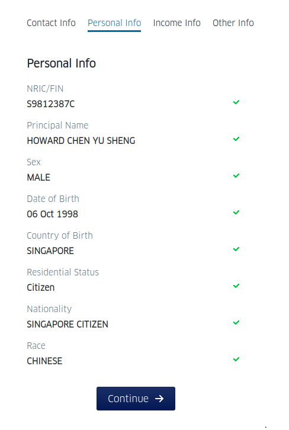
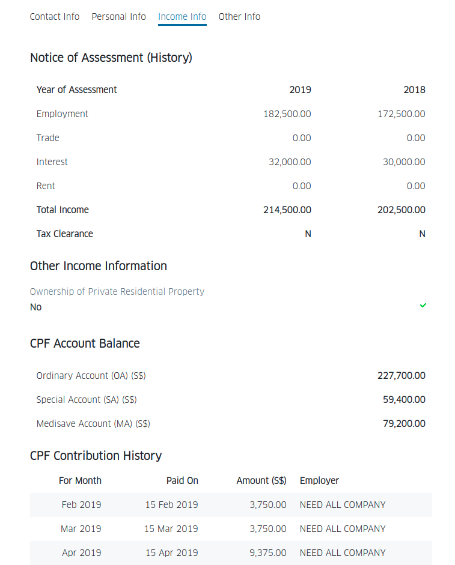

Ablr Coding Challenge 2020 (Django + React)
===========================================

## Overview

Use the existing code provided (or roll your own as you see fit), build a **Django-backed** application with
**React frontend** to demonstrate the integration with MyInfo APIs, similar to the Demo app provided by 
Singapore Government Technology Agency (GovTech): https://github.com/ndi-trusted-data/myinfo-demo-app


## Evaluation Criteria

We will look at your project and assess it for:

1. Extensibility - separation of concerns.
2. Simplicity - aim for the simplest solution that gets the job done whilst remaining
readable, extensible and testable.
3. Test Coverage - breaking changes should break your tests.
4. Robustness - should handle and report errors.
If you have any questions about these criteria please ask.

## Specifications

1. Include a README with (accurate) usage instructions.


## Submission

Github is the preferred option (a public repo is fine) but we will also accept a .zip file if
necessary. Email your solution to gordon@ablr.com.


## MyInfo Python API Usage

Set up virtualenv

```shell script
python3 -m venv env
source env/bin/activate
pip install -r requirements.txt
```

In python shell

```python
from myinfo.client import MyInfoClient
from myinfo.security import get_decoded_access_token, get_decrypted_person_data

client = MyInfoClient()
client.get_authorise_url(state="blahblah")
# Open up this SingPass Authorise URL and follow instructions
# After clicking on the green "I Agree" button, you'll be redirected back to
# http://localhost:3001/callback?code=25e3a9679bfc9baca7ef47bceadea43fcd6eb199&state=blahblah
# Then grab the code for the next API call

# Getting access token with code
code = "393ec926baee2ae4b351181a9e26f8c837afd845"
resp = client.get_access_token(code)
access_token = resp["access_token"]

# Decoding access token
decoded_access_token = get_decoded_access_token(access_token)
uinfin = decoded_access_token["sub"]

# Getting person data
resp = client.get_person(uinfin=uinfin, access_token=access_token)
decrypted = get_decrypted_person_data(resp)
print(decrypted)
```


```
{
	"employmentsector": {
		"lastupdated": "2022-09-21",
		"source": "3",
		"classification": "C",
		"value": ""
	},
	"uinfin": {
		"lastupdated": "2022-09-21",
		"source": "1",
		"classification": "C",
		"value": "S6005048A"
	},
	"name": {
		"lastupdated": "2022-09-21",
		"source": "1",
		"classification": "C",
		"value": "ANDY LAU"
	},
	"sex": {
		"lastupdated": "2022-09-21",
		"code": "M",
		"source": "1",
		"classification": "C",
		"desc": "MALE"
	},
	"race": {
		"lastupdated": "2022-09-21",
		"code": "CN",
		"source": "1",
		"classification": "C",
		"desc": "CHINESE"
	},
	"nationality": {
		"lastupdated": "2022-09-21",
		"code": "SG",
		"source": "1",
		"classification": "C",
		"desc": "SINGAPORE CITIZEN"
	},
	"dob": {
		"lastupdated": "2022-09-21",
		"source": "1",
		"classification": "C",
		"value": "1988-10-06"
	},
	"email": {
		"lastupdated": "2022-09-21",
		"source": "4",
		"classification": "C",
		"value": ""
	},
	"mobileno": {
		"lastupdated": "2022-09-21",
		"source": "4",
		"classification": "C",
		"areacode": {
			"value": ""
		},
		"prefix": {
			"value": ""
		},
		"nbr": {
			"value": ""
		}
	},
	"regadd": {
		"country": {
			"code": "SG",
			"desc": "SINGAPORE"
		},
		"unit": {
			"value": "10"
		},
		"street": {
			"value": "ANCHORVALE DRIVE"
		},
		"lastupdated": "2022-09-21",
		"block": {
			"value": "319"
		},
		"source": "1",
		"postal": {
			"value": "542319"
		},
		"classification": "C",
		"floor": {
			"value": "38"
		},
		"type": "SG",
		"building": {
			"value": ""
		}
	},
	"housingtype": {
		"lastupdated": "2022-09-21",
		"code": "",
		"source": "1",
		"classification": "C",
		"desc": ""
	},
	"hdbtype": {
		"lastupdated": "2022-09-21",
		"code": "115",
		"source": "1",
		"classification": "C",
		"desc": "5-ROOM FLAT (HDB)"
	},
	"marital": {
		"lastupdated": "2022-09-21",
		"code": "2",
		"source": "1",
		"classification": "C",
		"desc": "MARRIED"
	},
	"edulevel": {
		"lastupdated": "2022-09-21",
		"code": "",
		"source": "2",
		"classification": "C",
		"desc": ""
	},
	"ownerprivate": {
		"lastupdated": "2022-09-21",
		"source": "1",
		"classification": "C",
		"value": "false"
	},
	"cpfcontributions": {
		"lastupdated": "2022-09-21",
		"source": "1",
		"history": [{
			"date": {
				"value": "2021-07-20"
			},
			"employer": {
				"value": "ABC"
			},
			"amount": {
				"value": 1055.12
			},
			"month": {
				"value": "2021-07"
			}
		}, {
			"date": {
				"value": "2021-08-20"
			},
			"employer": {
				"value": "ABC"
			},
			"amount": {
				"value": 1055.12
			},
			"month": {
				"value": "2021-08"
			}
		}, {
			"date": {
				"value": "2021-09-20"
			},
			"employer": {
				"value": "ABC"
			},
			"amount": {
				"value": 1055.12
			},
			"month": {
				"value": "2021-09"
			}
		}, {
			"date": {
				"value": "2021-10-20"
			},
			"employer": {
				"value": "ABC"
			},
			"amount": {
				"value": 1055.12
			},
			"month": {
				"value": "2021-10"
			}
		}, {
			"date": {
				"value": "2021-11-20"
			},
			"employer": {
				"value": "ABC"
			},
			"amount": {
				"value": 1055.12
			},
			"month": {
				"value": "2021-11"
			}
		}, {
			"date": {
				"value": "2021-12-20"
			},
			"employer": {
				"value": "ABC"
			},
			"amount": {
				"value": 1055.12
			},
			"month": {
				"value": "2021-12"
			}
		}, {
			"date": {
				"value": "2022-01-20"
			},
			"employer": {
				"value": "ABC"
			},
			"amount": {
				"value": 3300.88
			},
			"month": {
				"value": "2022-01"
			}
		}, {
			"date": {
				"value": "2022-02-20"
			},
			"employer": {
				"value": "ABC"
			},
			"amount": {
				"value": 1055.12
			},
			"month": {
				"value": "2022-02"
			}
		}, {
			"date": {
				"value": "2022-03-20"
			},
			"employer": {
				"value": "ABC"
			},
			"amount": {
				"value": 1808.34
			},
			"month": {
				"value": "2022-03"
			}
		}, {
			"date": {
				"value": "2022-04-20"
			},
			"employer": {
				"value": "ABC"
			},
			"amount": {
				"value": 1055.12
			},
			"month": {
				"value": "2022-04"
			}
		}, {
			"date": {
				"value": "2022-05-20"
			},
			"employer": {
				"value": "ABC"
			},
			"amount": {
				"value": 1055.12
			},
			"month": {
				"value": "2022-05"
			}
		}, {
			"date": {
				"value": "2022-06-20"
			},
			"employer": {
				"value": "ABC"
			},
			"amount": {
				"value": 1055.12
			},
			"month": {
				"value": "2022-06"
			}
		}, {
			"date": {
				"value": "2022-07-20"
			},
			"employer": {
				"value": "ABC"
			},
			"amount": {
				"value": 1055.12
			},
			"month": {
				"value": "2022-07"
			}
		}, {
			"date": {
				"value": "2022-08-20"
			},
			"employer": {
				"value": "ABC"
			},
			"amount": {
				"value": 1055.12
			},
			"month": {
				"value": "2022-08"
			}
		}, {
			"date": {
				"value": "2022-09-20"
			},
			"employer": {
				"value": "ABC"
			},
			"amount": {
				"value": 1055.12
			},
			"month": {
				"value": "2022-09"
			}
		}],
		"classification": "C"
	},
	"cpfbalances": {
		"oa": {
			"value": 56343.35
		},
		"ma": {
			"value": 32455.22
		},
		"lastupdated": "2022-09-21",
		"source": "1",
		"classification": "C",
		"sa": {
			"value": 42521.4
		},
		"ra": {
			"value": 89323.58
		}
	},
	"birthcountry": {
		"lastupdated": "2022-09-21",
		"code": "SG",
		"source": "1",
		"classification": "C",
		"desc": "SINGAPORE"
	},
	"residentialstatus": {
		"lastupdated": "2022-09-21",
		"code": "C",
		"source": "1",
		"classification": "C",
		"desc": "CITIZEN"
	},
	"aliasname": {
		"lastupdated": "2022-09-21",
		"source": "1",
		"classification": "C",
		"value": ""
	},
	"marriedname": {
		"lastupdated": "2022-09-21",
		"source": "1",
		"classification": "C",
		"value": ""
	},
	"passtype": {
		"lastupdated": "2022-09-21",
		"code": "",
		"source": "3",
		"classification": "C",
		"desc": ""
	},
	"noahistory": {
		"noas": [{
			"amount": {
				"value": 200456.1
			},
			"trade": {
				"value": 15000
			},
			"interest": {
				"value": 8123
			},
			"yearofassessment": {
				"value": "2021"
			},
			"taxclearance": {
				"value": "N"
			},
			"employment": {
				"value": 200000
			},
			"rent": {
				"value": 7839
			},
			"category": {
				"value": "ADDITIONAL"
			}
		}, {
			"amount": {
				"value": 200456.1
			},
			"trade": {
				"value": 15000
			},
			"interest": {
				"value": 8123
			},
			"yearofassessment": {
				"value": "2020"
			},
			"taxclearance": {
				"value": "N"
			},
			"employment": {
				"value": 200000
			},
			"rent": {
				"value": 7839
			},
			"category": {
				"value": "ADDITIONAL"
			}
		}],
		"lastupdated": "2022-09-21",
		"source": "1",
		"classification": "C"
	}
}
```


### Sample work

* Contact Info


* Personal Info



* Income Info


